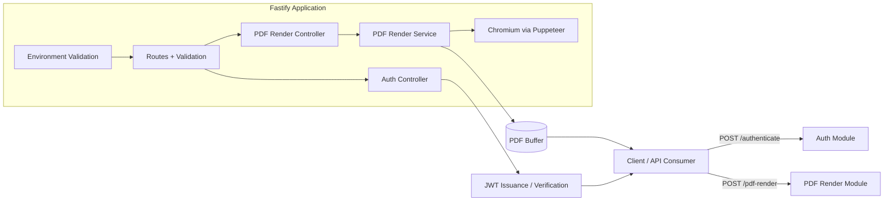

# FastPDF Architecture Diagram

## Current architecture notes

- The service is synchronous: each request receives a PDF response directly from the HTTP request.
- Authentication uses a shared password at /authenticate and JWTs for protected PDF rendering.
- PDF generation runs in-process with Puppeteer and Chromium.
- Sentry reporting is optional and captures errors and unhandled exceptions when SENTRY_DSN is configured.
- Request and rendering logs remain in the local container logs.
- `npm run test:sentry` deliberately sends one smoke-test exception for delivery verification.
